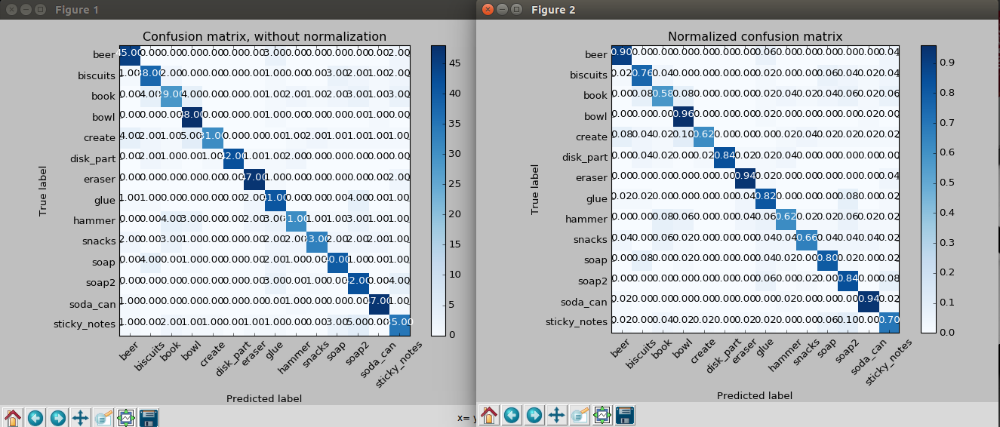
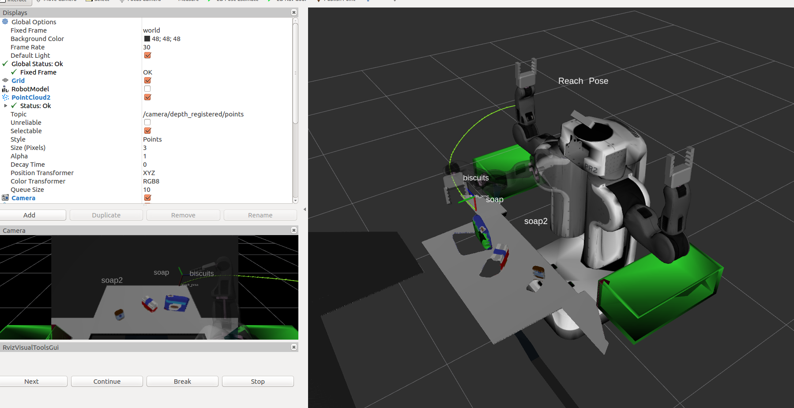
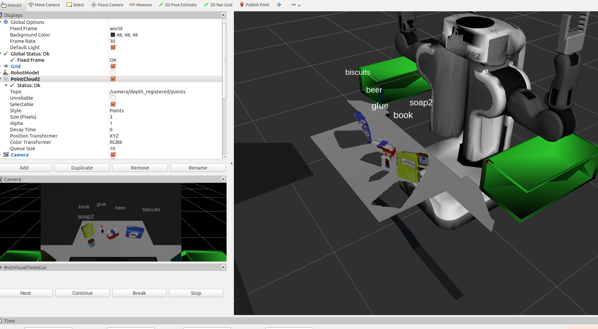
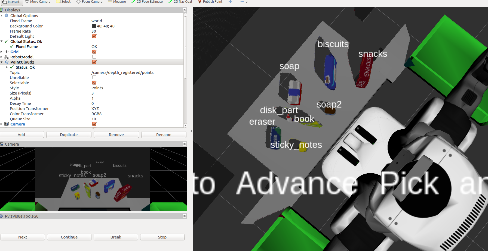

## Project: Perception Pick & Place
### Writeup Template: You can use this file as a template for your writeup if you want to submit it as a markdown file, but feel free to use some other method and submit a pdf if you prefer.

---


# Required Steps for a Passing Submission:
1. Extract features and train an SVM model on new objects (see `pick_list_*.yaml` in `/pr2_robot/config/` for the list of models you'll be trying to identify). 
2. Write a ROS node and subscribe to `/pr2/world/points` topic. This topic contains noisy point cloud data that you must work with.
3. Use filtering and RANSAC plane fitting to isolate the objects of interest from the rest of the scene.
4. Apply Euclidean clustering to create separate clusters for individual items.
5. Perform object recognition on these objects and assign them labels (markers in RViz).
6. Calculate the centroid (average in x, y and z) of the set of points belonging to that each object.
7. Create ROS messages containing the details of each object (name, pick_pose, etc.) and write these messages out to `.yaml` files, one for each of the 3 scenarios (`test1-3.world` in `/pr2_robot/worlds/`).  [See the example `output.yaml` for details on what the output should look like.](https://github.com/udacity/RoboND-Perception-Project/blob/master/pr2_robot/config/output.yaml)  
8. Submit a link to your GitHub repo for the project or the Python code for your perception pipeline and your output `.yaml` files (3 `.yaml` files, one for each test world).  You must have correctly identified 100% of objects from `pick_list_1.yaml` for `test1.world`, 80% of items from `pick_list_2.yaml` for `test2.world` and 75% of items from `pick_list_3.yaml` in `test3.world`.
9. Congratulations!  Your Done!

# Extra Challenges: Complete the Pick & Place
7. To create a collision map, publish a point cloud to the `/pr2/3d_map/points` topic and make sure you change the `point_cloud_topic` to `/pr2/3d_map/points` in `sensors.yaml` in the `/pr2_robot/config/` directory. This topic is read by Moveit!, which uses this point cloud input to generate a collision map, allowing the robot to plan its trajectory.  Keep in mind that later when you go to pick up an object, you must first remove it from this point cloud so it is removed from the collision map!
8. Rotate the robot to generate collision map of table sides. This can be accomplished by publishing joint angle value(in radians) to `/pr2/world_joint_controller/command`
9. Rotate the robot back to its original state.
10. Create a ROS Client for the “pick_place_routine” rosservice.  In the required steps above, you already created the messages you need to use this service. Checkout the [PickPlace.srv](https://github.com/udacity/RoboND-Perception-Project/tree/master/pr2_robot/srv) file to find out what arguments you must pass to this service.
11. If everything was done correctly, when you pass the appropriate messages to the `pick_place_routine` service, the selected arm will perform pick and place operation and display trajectory in the RViz window
12. Place all the objects from your pick list in their respective dropoff box and you have completed the challenge!
13. Looking for a bigger challenge?  Load up the `challenge.world` scenario and see if you can get your perception pipeline working there!

## [Rubric](https://review.udacity.com/#!/rubrics/1067/view) Points
### Here I will consider the rubric points individually and describe how I addressed each point in my implementation.  

---
### Writeup / README

#### 1. Provide a Writeup / README that includes all the rubric points and how you addressed each one.  You can submit your writeup as markdown or pdf.  

You're reading it!

### Exercise 1, 2 and 3 pipeline implemented
#### 1. Complete Exercise 1 steps. Pipeline for filtering and RANSAC plane fitting implemented.

- Step 1: Voxel Filter for Downsampling

  ```python
  vox = cloud.make_voxel_grid_filter()

  # Choose a voxel (also known as leaf) size
  # Note: this (1) is a poor choice of leaf size   
  # Experiment and find the appropriate size!
  LEAF_SIZE = 0.01     

  # Set the voxel (or leaf) size  
  vox.set_leaf_size(LEAF_SIZE, LEAF_SIZE, LEAF_SIZE)

  # Call the filter function to obtain the resultant downsampled point cloud
  cloud_filtered = vox.filter()
  ```

  The `LEAF_SIZE` should be manually tuned based on different input cloud point.

- Step 2: PassThrough filter for specific axis region

  ```python
  # Create a PassThrough filter object.
  passthrough = cloud_filtered.make_passthrough_filter()

  # Assign axis and range to the passthrough filter object.
  filter_axis = 'z'
  passthrough.set_filter_field_name(filter_axis)
  axis_min = 0.6
  axis_max = 1.1
  passthrough.set_filter_limits(axis_min, axis_max)
  # Finally use the filter function to obtain the resultant point cloud. 
  cloud_filtered = passthrough.filter()
  ```

  Z axis is the key axis to separate the ROI with background cloud points. The major function by using PassThrough in this experiment is to separate the table and objects.

- Step 3:  RANSAC method for plane segmentation

  ```python
  # Create the segmentation object
  seg = cloud_filtered.make_segmenter()

  # Set the model you wish to fit 
  seg.set_model_type(pcl.SACMODEL_PLANE)
  seg.set_method_type(pcl.SAC_RANSAC)

  # Max distance for a point to be considered fitting the model
  # Experiment with different values for max_distance 
  # for segmenting the table
  max_distance = 0.01
  seg.set_distance_threshold(max_distance)

  # Call the segment function to obtain set of inlier indices and model coefficients
  inliers, coefficients = seg.segment()
  ```

  There several types for RANSAC, and here we chose the `pcl.SACMODEL_PLANE` and `pcl.SAC_RANSAC` with the parameter`max_distance=0.01` for plane segmentation.

- Step 4: Separate inliers and outliers

  ```python
  # Extract inliers
  extracted_inliers = cloud_filtered.extract(inliers, negative=False)
  extracted_outliers = cloud_filtered.extract(inliers, negative=True)
  ```

  ​

#### 2. Complete Exercise 2 steps: Pipeline including clustering for segmentation implemented.  

- Based on Exercise 1, we used Euclidean Clustering.

- Step 1: Transfer XYZRGB to XYZ

  ```python
  white_cloud = XYZRGB_to_XYZ(extracted_outliers)
  ```

- Step 2: Build the kdtree

  ```python
  tree = white_cloud.make_kdtree()
  ```

- Step 3: Create a cluster extraction object

  ```python
  ec = white_cloud.make_EuclideanClusterExtraction()
  ```

  There are several parameters that we need tune it carefully

  ```python
  # Your task is to experiment and find values that work for segmenting objects.
  ec.set_ClusterTolerance(0.01)
  ec.set_MinClusterSize(100)
  # Refering to the minimum and maximum number of points that make up an object's cluster
  ec.set_MaxClusterSize(50000)
  # Search the k-d tree for clusters
  ec.set_SearchMethod(tree)
  ```

  Then, extract the indices

  ```python
  cluster_indices = ec.Extract()
  ```

-  Step 4: Set unique color to each part.

  ```python
  cluster_color = get_color_list(len(cluster_indices))

  color_cluster_point_list = []

  for j, indices in enumerate(cluster_indices):
      for i, indice in enumerate(indices):
          color_cluster_point_list.append([white_cloud[indice][0],
                                           white_cloud[indice][1],
                                           white_cloud[indice][2],
                                           rgb_to_float(cluster_color[j])])

  #Create new cloud containing all clusters, each with unique color
  cluster_cloud = pcl.PointCloud_PointXYZRGB()
  cluster_cloud.from_list(color_cluster_point_list)
  ```

  ​

#### 2. Complete Exercise 3 Steps.  Features extracted and SVM trained.  Object recognition implemented.

- Step 1: Configure the training datasets

  ```python
  models = [\
         'hammer',
         'biscuits',
         'soap',
         'soap2',
         'book',
         'beer',
         'glue',
         'disk_part',
         'snacks',
         'eraser',
         'create',
         'soda_can',
         'sticky_notes',
         'bowl']
  ```

- Step 2: Random show each model in Gazebo to get the cloud point one by one.

  ```python
  for i in range(50):
      # make five attempts to get a valid a point cloud then give up
      sample_was_good = False
      try_count = 0
      while not sample_was_good and try_count < 5:
          sample_cloud = capture_sample()
          sample_cloud_arr = ros_to_pcl(sample_cloud).to_array()

          # Check for invalid clouds.
          if sample_cloud_arr.shape[0] == 0:
              print('Invalid cloud detected')
              try_count += 1
              else:
                  sample_was_good = True
  ```

- Step 3: Get the `chists` and `nhists` to save the features for training.

  ```python
  chists = compute_color_histograms(sample_cloud, using_hsv=True)
  normals = get_normals(sample_cloud)
  nhists = compute_normal_histograms(normals)
  feature = np.concatenate((chists, nhists))
  labeled_features.append([feature, model_name])
  ```

  In file `features.py`, we should set the parameters for color and normal histogram features extraction.

  - For Color Histograms,

    ```python
    nbins = 32
    bins_range = (0, 256)
    channel_1_hist = np.histogram(channel_1_vals, bins=nbins, range=bins_range)
    channel_2_hist = np.histogram(channel_2_vals, bins=nbins, range=bins_range)
    channel_3_hist = np.histogram(channel_3_vals, bins=nbins, range=bins_range)
    ```

  - For Normal Histograms,

    ```python
    nbins = 32
    bins_range = (-1, 1)
    norm_x_hist = np.histogram(norm_x_vals, bins=nbins, range=bins_range)
    norm_y_hist = np.histogram(norm_y_vals, bins=nbins, range=bins_range)
    norm_z_hist = np.histogram(norm_z_vals, bins=nbins, range=bins_range)
    ```

- Step 4: Training the recored models by file `train_svm.py`

  We did this by using `sklearn` library.  For initialization, we set

  ```python
  X = np.array(feature_list)
  # Fit a per-column scaler
  X_scaler = StandardScaler().fit(X)
  # Apply the scaler to X
  X_train = X_scaler.transform(X)
  y_train = np.array(label_list)
  # Convert label strings to numerical encoding
  encoder = LabelEncoder()
  y_train = encoder.fit_transform(y_train)
  ```

  Set SVM parameters and implement the classification

  ```python
  # Create classifier
  clf = svm.SVC(kernel='linear', C=1.0, gamma='auto')

  # Set up 5-fold cross-validation
  kf = cross_validation.KFold(len(X_train),
                              n_folds=5,
                              shuffle=True,
                              random_state=1)
  ```

  Do cross validation and train the classifier

  ```python
  # Gather predictions
  predictions = cross_validation.cross_val_predict(cv=kf,
                                            estimator=clf,
                                            X=X_train, 
                                            y=y_train
                                           )

  accuracy_score = metrics.accuracy_score(y_train, predictions)
  print('accuracy score: '+str(accuracy_score))

  confusion_matrix = metrics.confusion_matrix(y_train, predictions)
  class_names = encoder.classes_.tolist()

  #Train the classifier
  clf.fit(X=X_train, y=y_train)
  ```

- The training result are shown in following image

  

### Pick and Place Setup

#### 1. For all three tabletop setups (`test*.world`), perform object recognition, then read in respective pick list (`pick_list_*.yaml`). Next construct the messages that would comprise a valid `PickPlace` request output them to `.yaml` format.

#### 1.1 Algorithms Details

1. Write a ROS node and subscribe to `/pr2/world/points` topic. This topic contains noisy point cloud data that you must work with.

   - Define the callback function

     ```python
     pcl_sub = rospy.Subscriber("/pr2/world/points", pc2.PointCloud2, pcl_callback, queue_size=1)
     ```

   - Some other publishers also needed 

     ```python
     pcl_cluster_pub = rospy.Publisher("/pcl_world", PointCloud2, queue_size=1)
     # Publishers for the objects and the table
     pcl_objects_pub = rospy.Publisher("/pcl_objects", PointCloud2, queue_size=1)
     pcl_table_pub = rospy.Publisher("/pcl_table", PointCloud2, queue_size=1)
     # Other publishers for the markers and labels
     object_markers_pub = rospy.Publisher("/object_markers", Marker, queue_size=1)
     detected_objects_pub = rospy.Publisher("/detected_objects", DetectedObjectsArray, queue_size=1)
     ```

2. Use filtering and RANSAC plane fitting to isolate the objects of interest from the rest of the scene.

   - As  Exercise 1, 2, 3 mentioned, we could separate the segments by using Voxel Downsampling, PassThrough Filter, RANSAC-based Plane Segmentation and Euclidean Clustering in `pcl_callback(pcl_msg)`

     ```python
     ### Convert ROS msg to PCL data
     cloud = ros_to_pcl(pcl_msg)


     ### Voxel Grid Downsampling
     # Create a VoxelGrid filter object for our input point cloud
     vox = cloud.make_voxel_grid_filter()

     # Choose a voxel (also known as leaf) size
     # Note: this (1) is a poor choice of leaf size   
     # Experiment and find the appropriate size!
     LEAF_SIZE = 0.003


     # Set the voxel (or leaf) size  
     vox.set_leaf_size(LEAF_SIZE, LEAF_SIZE, LEAF_SIZE)

     # Call the filter function to obtain the resultant downsampled point cloud
     cloud_filtered = vox.filter()

     ### Statistical Outlier Removal Filter
     # Much like the previous filters, we start by creating a filter object: 
     outlier_filter = cloud_filtered.make_statistical_outlier_filter()

     # Set the number of neighboring points to analyze for any given point
     outlier_filter.set_mean_k(50)

     # Set threshold scale factor
     x = 1.0

     # Any point with a mean distance larger than global (mean distance+x*std_dev) will be considered outlier
     outlier_filter.set_std_dev_mul_thresh(x)

     # Finally call the filter function for magic
     cloud_filtered = outlier_filter.filter()


     ### PassThrough Filter
     # Create a PassThrough filter object first across the Z axis
     passThroughZ = cloud_filtered.make_passthrough_filter()

     # Assign axis and range to the passthrough filter object.
     filter_axis = 'z'
     passThroughZ.set_filter_field_name(filter_axis)
     axis_min = 0.6
     axis_max = 1.1
     passThroughZ.set_filter_limits(axis_min, axis_max)

     # Finally use the filter function to obtain the resultant point cloud. 
     cloud_filtered = passThroughZ.filter()

     ## Now, Create a PassThrough filter object across the Y axis
     passThroughY = cloud_filtered.make_passthrough_filter()
     # Assign axis and range to the passthrough filter object.
     filter_axis = 'y'
     passThroughY.set_filter_field_name(filter_axis)
     axis_min = -0.5
     axis_max = 0.5
     passThroughY.set_filter_limits(axis_min, axis_max)

     # Finally use the filter function to obtain the resultant point cloud. 
     cloud_filtered = passThroughY.filter()


     ### RANSAC Plane Segmentation
     # Create the segmentation object
     seg = cloud_filtered.make_segmenter()

     # Set the model you wish to fit 
     seg.set_model_type(pcl.SACMODEL_PLANE)
     seg.set_method_type(pcl.SAC_RANSAC)

     # Max distance for a point to be considered fitting the model
     # Experiment with different values for max_distance 
     # for segmenting the table
     max_distance = 0.01
     seg.set_distance_threshold(max_distance)

     # Call the segment function to obtain set of inlier indices and model coefficients
     inliers, coefficients = seg.segment()


     ### Extract inliers and outliers
     extracted_inliers = cloud_filtered.extract(inliers, negative=False)
     extracted_outliers = cloud_filtered.extract(inliers, negative=True)

     ### Euclidean Clustering
     # Go from XYZRGB to RGB since to build the k-d tree we only needs spatial data
     white_cloud = XYZRGB_to_XYZ(extracted_outliers)
     # Apply function to convert XYZRGB to XYZ
     tree = white_cloud.make_kdtree()

     ### Create a cluster extraction object
     ec = white_cloud.make_EuclideanClusterExtraction()
     # Set tolerances for distance threshold 
     # as well as minimum and maximum cluster size (in points)
     # Your task is to experiment and find values that work for segmenting objects.
     ec.set_ClusterTolerance(0.01)
     ec.set_MinClusterSize(100)
     # Refering to the minimum and maximum number of points that make up an object's cluster
     ec.set_MaxClusterSize(50000)
     # Search the k-d tree for clusters
     ec.set_SearchMethod(tree)
     # Extract indices for each of the discovered clusters
     cluster_indices = ec.Extract()

     ```

   - They we need to classify the `luster_incidces` by SVM classifier in a `for` loop

     ```python
     for index, pts_list in enumerate(cluster_indices):
     ```

   - Get each point clouds according to the `pts_list`

     ```python
     pcl_cluster = extracted_outliers.extract(pts_list)
     ros_cluster = pcl_to_ros(pcl_cluster)
     ```

   - Extract the features based on 

     ```python
     # Complete this step just as is covered in capture_features.py
     chists = compute_color_histograms(ros_cluster, using_hsv=True)
     normals = get_normals(ros_cluster)
     nhists = compute_normal_histograms(normals)
     feature = np.concatenate((chists, nhists))
     ```

   - Predict the label

     ```python
     prediction = clf.predict(scaler.transform(feature.reshape(1,-1)))
     label = encoder.inverse_transform(prediction)[0]
     detected_objects_labels.append(label)
     ```

3. Perform object recognition on these objects and assign them labels (markers in RViz).

   ```python
   # Publish a label into RViz
   label_pos = list(white_cloud[pts_list[0]])
   label_pos[2] += .4
   object_markers_pub.publish(make_label(label,label_pos, index))

   # Add the detected object to the list of detected objects.
   do = DetectedObject()
   do.label = label
   do.cloud = ros_cluster
   detected_objects.append(do)

   detected_objects_pub.publish(detected_objects)
   ```

   ​

4. Calculate the centroid (average in x, y and z) of the set of points belonging to that each object.

   We should calculate the centroid in each clustered point cloud.

   ```python
   labels = []
   centroids = [] # to be list of tuples (x, y, z)
   for object in object_list:
       labels.append(object.label)
       points_arr = ros_to_pcl(object.cloud).to_array()
       temp = np.mean(points_arr, axis=0)[:3]
       centroids.append(temp)
   ```

#### 1.2 Test results

- For `test1.world`

  

- For `test2.world`

  

- For `test3.world`

  

#### 1.3 Comments

Spend some time at the end to discuss your code, what techniques you used, what worked and why, where the implementation might fail and how you might improve it if you were going to pursue this project further.  


